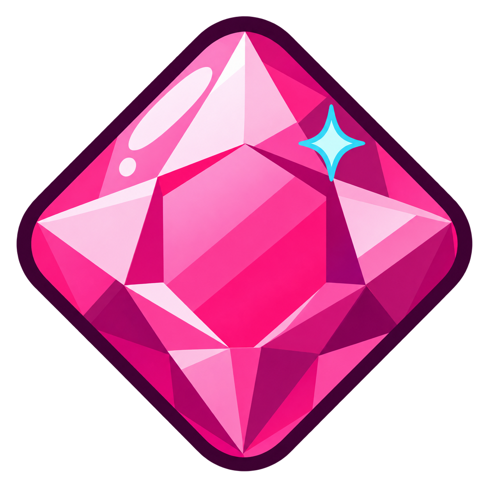
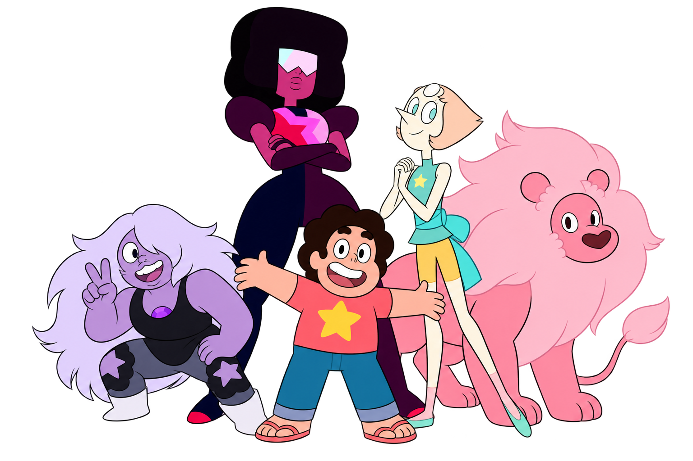

<div align="center">
  

  <h1>Steven Universo</h1>

  <p><strong>Um portal interativo para explorar histórias, personagens e conexões.</strong></p>
  <p>Conheça Beach City, as Crystal Gems e tudo o que torna esse universo tão especial.</p>

  <p>
    <a href="https://steven-universo-next.vercel.app">
      
    </a>
    <a href="https://github.com/pi-1semestre/framework-frontend-colab">
      
    </a>
  </p>
</div>

<br />



## ✦ Sobre o portal

O **Steven Universo** é um projeto colaborativo que reúne informações sobre a animação em uma experiência visual, responsiva e interativa. Todo o conteúdo está organizado em uma única página, com navegação simples entre as seções.

> Da história da série às músicas e curiosidades: um espaço feito por fãs para celebrar o universo criado por Rebecca Sugar.

## ✦ O que você encontra

| Explore | Interaja |
| --- | --- |
| História e ordem da franquia | Filtros e perfis de personagens |
| Personagens e Crystal Gems | Carrosséis de jogos e fusões |
| Lugares, temas e fusões | Vídeos e player de músicas |
| Jogos e momentos marcantes | Quiz com perguntas variadas |
| Curiosidades e premiações | Controle de spoilers |
| Vida e obra de Rebecca Sugar | Navegação adaptada para qualquer tela |

## ✦ Acesse o projeto

O portal está publicado e pode ser acessado pelo endereço:

### [steven-universo-next.vercel.app](https://steven-universo-next.vercel.app)

## ✦ Construído com Next.js

O **Next.js 16**, utilizando o **App Router**, é o framework adotado no projeto. A organização das rotas, os componentes, as imagens otimizadas, as fontes e os metadados da aplicação seguem os recursos oferecidos pelo Next.js.

TypeScript e CSS são utilizados como apoio para tipagem e apresentação visual. A publicação é realizada na Vercel.

## ✦ Executando localmente

Você precisa ter o [Node.js](https://nodejs.org/) **20.9 ou superior** instalado.

```bash
git clone https://github.com/pi-1semestre/framework-frontend-colab.git
cd framework-frontend-colab
npm ci
npm run dev
```

Acesse [http://localhost:3000](http://localhost:3000) no navegador. Nenhuma variável de ambiente é obrigatória para executar o portal localmente.

### Comandos

| Comando | Ação |
| --- | --- |
| `npm run dev` | Inicia o ambiente de desenvolvimento |
| `npm run build` | Gera a aplicação para produção |
| `npm start` | Executa a versão de produção |
| `npm run lint` | Verifica a qualidade do código |
| `npm run lint:fix` | Corrige problemas identificados pelo ESLint |

## ✦ Organização

```text
app/
├── _components/   seções e elementos da interface
├── _data/         conteúdo utilizado pelo portal
├── globals.css    identidade visual e responsividade
├── layout.tsx     estrutura e metadados
└── page.tsx       página principal

public/
├── artwork/       artes de destaque
├── characters/    imagens dos personagens
├── fusions/       imagens das fusões
├── games/         capas dos jogos
└── people/        fotografias
```

## ✦ Colaboração

O projeto foi construído em equipe. Veja os participantes e o histórico de desenvolvimento na página de [contribuidores](https://github.com/pi-1semestre/framework-frontend-colab/graphs/contributors).

---

<p align="center">
  Projeto de fã, sem fins comerciais.<br />
  <em>Steven Universe</em> e seus personagens pertencem aos respectivos detentores de direitos.
</p>
